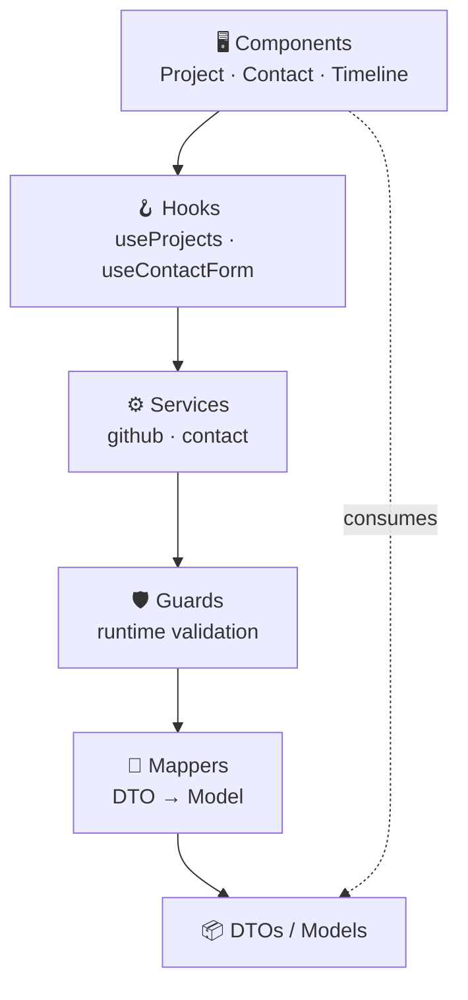

<div align="center">

# 🌟 Venu Gopal — Developer Portfolio

A fast, accessible, fully-typed portfolio built with **React 18 + TypeScript**, featuring a clean DTO-driven data layer, live GitHub project sync, and a dark/light themed UI.

[](https://venupagadala.github.io/my-website/)
[](https://github.com/venupagadala/my-website)
[](https://www.linkedin.com/in/venu-pagadala-77ab3a251/)
[](LICENSE)

</div>

---

## ✨ Highlights

- **Strictly typed** — end-to-end TypeScript with a DTO → mapper → model data layer, runtime type guards at every API boundary
- **Performance first** — code-splitting, lazy routes, WebP imagery (676 KB → 97 KB), explicit dimensions for zero CLS
- **Accessible** — WCAG-minded contrast, 44×44 touch targets, ARIA roles, skip links, reduced-motion support
- **Live GitHub feed** — projects auto-pull from the GitHub API, validated and normalized before render
- **Theming** — cohesive dark/light mode across every section

## 🛠️ Tech Stack

| Layer | Tools |
|-------|-------|
| **UI** |      |
| **Backend** |    |
| **Tooling** |    |

## 🧱 Architecture

A layered, dependency-down design — UI never touches raw API shapes.



**Request flow:** `fetch → guard-validate → map → domain model → hook → component`. Each step is isolated, testable, and typed.

## 📁 Structure

```
src/
├── api/dto/        # Raw API contracts
├── api/guards/     # Runtime type validation
├── types/          # UI domain models
├── mappers/        # DTO → model transforms
├── services/       # fetch + validate + map
├── hooks/          # React lifecycle only
├── components/     # Presentation
└── assets/styles/  # SCSS + theming
```

## � Getting Started

```bash
git clone https://github.com/venupagadala/my-website.git
cd my-website && npm install
npm start        # dev server at localhost:3000
npm run build    # production bundle
npm run deploy   # publish to GitHub Pages
```

## � Deployment

Frontend ships to **GitHub Pages** via `gh-pages`; the contact API runs on **Render**. Merge to `main`, then `npm run deploy`.

## 📄 License

MIT © Venu Gopal
